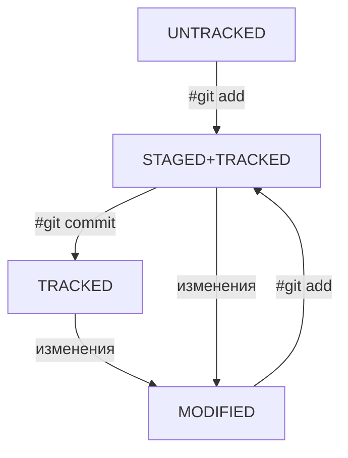

# Краткая справка по использованию Git и GitHub
## Базовая работа с Git
* Инициализация локального репозитория: `git init`
* Добавление файлов в индекс: `git add <file or directory>`
* Проверка статуса файлов в репозитории: `git status`
* Создание коммитов: `git commit -m "<some text>"`
* Отображение лога коммитов: `git log` или `git log oneline` (для краткого лога)
## Базовая работа с GitHub (GitLab)
* Синхронизация локального репозитория с удалённым хранилищем: `git remote add <reponame> <branch>`
* Проверка статуса синхронизации репозитория: `git remote -v`
* Загрузка данных репозитория в удалённое хранилище: `git push`
* Загрузка данных удалённого хранилища в локальный репозиторий: `git pull`
## Порядок создания репозитория Git и создание первого коммита
1. Инициализировать репозитории командой `git init`
2. Добавить файлы в репозитории в индекс командой `git add <file or directory>`
3. Сделать коммит командой `git commit -m "<some text>"` Очень важно при этом указывать правильные пояснения к комиту. Комментарий к коммиту должен быть лаконичен, информативен, а объём информации не должен превышать 72 символа (Требования к комиту предьявляет компания, также есть стандарты по типу [Convertional Commits](https://www.conventionalcommits.org)
## Порядок синхронизации локального репозитория с удалённым хранилищем
1.  Синхронизировать локальный репозиторий с удалённым хранилищем: `git remote add <reponame> <branch>`
2. Записать изменения в удалённое хранилище:  `git push`
## Четыре типа состояния файлов в репозитории:
-   **`untracked`** (англ. «неотслеживаемый»)  --- файл не участвующий в версионировании Git. Чтобы начать отслеживание файла необходимо добавить его в индекс командой `git add <file or directory>`

- **`staged`**  файл попавший в **staging area** (от англ. _stage_ — «сцена», «этап [процесса]» и _area_ — «область»), то есть в список файлов, которые войдут в коммит. В этот момент файл находится в состоянии `staged`. Staging area также называют **index** (англ. «каталог») или **cache** (англ. «кеш»), а состояние файла `staged` иногда называют `indexed` или `cached`.
-   **`tracked`** (англ. «отслеживаемый»)  — противоположность `untracked`. Оно довольно широкое по смыслу: в него попадают файлы, которые уже были зафиксированы с помощью `git commit`, а также файлы, которые были добавлены в staging area командой `git add`. То есть все файлы, в которых Git так или иначе отслеживает изменения.
-   **`modified`** (англ. «изменённый»)  --- означает, что Git сравнил содержимое файла с последней сохранённой версией и нашёл отличия. Например, файл был закоммичен и после этого изменён.

